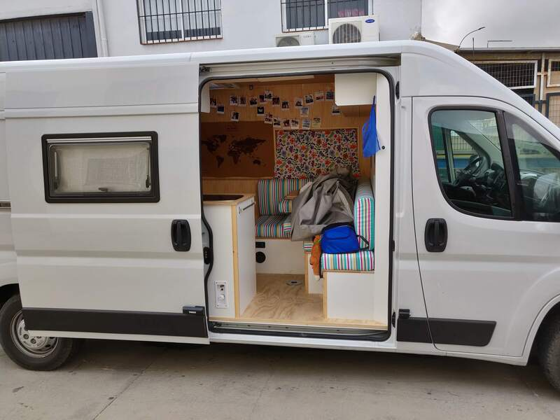
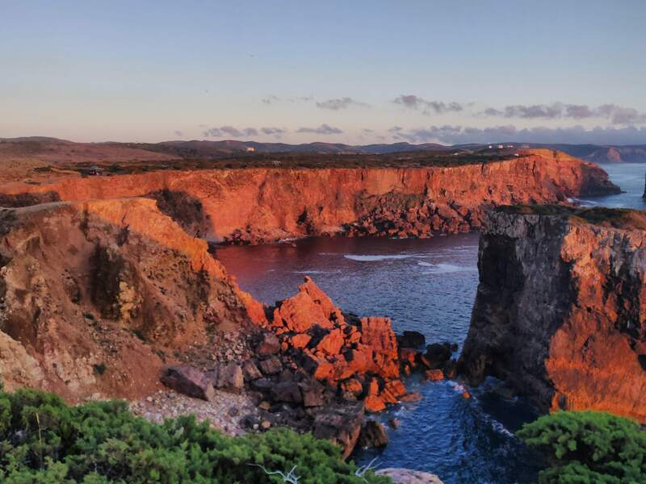
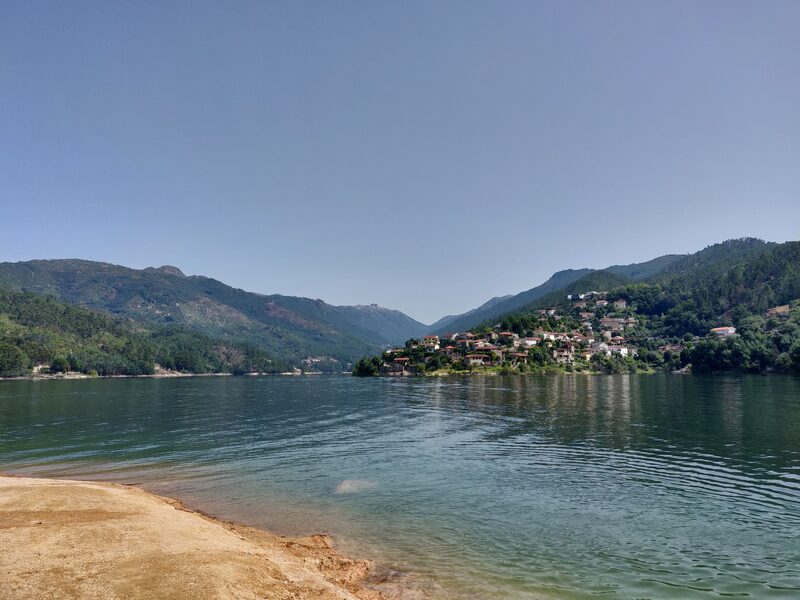
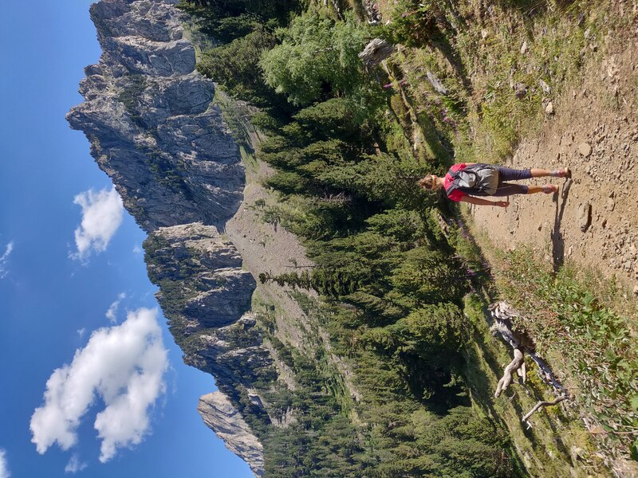
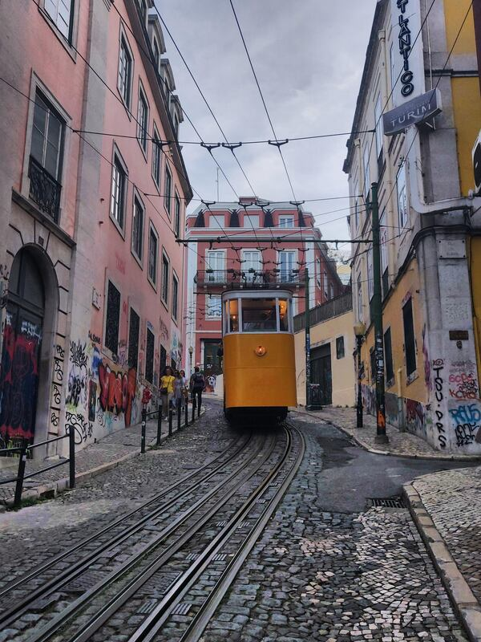

# In giro per l’Europa, e oltre!

Questa era la nostra idea principale. Stavamo pianificando il viaggio da un paio di settimane, sapevamo più o meno che itinerario avremmo seguito e le cose che non volevamo assolutamente perderci. Avevamo anche trovato alcuni posti dove dormire, grazie a Park4night… Avevamo organizzato alcune cose, e altre le avevamo lasciate in sospeso per fare spazio all’improvvisazione. Che pazzia sarebbe mai stata se avessimo organizzato tutto?

Il 30 maggio, come d’abitudine, ci siamo svegliati a casa dei fratelli di José per lavorare. Eravamo lì da qualche settimana e stavamo terminando i preparativi, ma quel giorno non sarebbe stato come i precedenti. Quel giorno avrebbe segnato un prima e un dopo, avrebbe cambiato le nostre vite. Quel giorno il nostro sogno si è finalmente realizzato. Siamo partiti con la nostra casetta, la Flowerneta, con destinazione Italia, per salutare la famiglia e gli amici di Fede e continuare il nostro viaggio per il mondo!

##  Prima destinazione! … Siviglia?

Quando ci immaginavamo di vivere e viaggiare nel furgone e guardavamo i diversi profili di vanlifers su Instagram, pensavamo che il giorno in cui saremmo partiti, ci saremmo lanciati verso la Norvegia a vedere le aurore boreali, o il Vietnam, o… beh, la nostra prima tappa invece è stata Siviglia (per chi non è esperto della geografia spagnola, si trova a un’ora di macchina da dove eravamo partiti!). Noi comunque eravamo contentissimi! Dovevamo salutare il migliore amico di José, Jesús, quindi siamo arrivati a Siviglia di sera, abbiamo partcheggiato, cenato con Jesús e passato lì la nostra prima notte!

Come vi abbiamo detto, ci immaginavamo che la nostra prima notte nella Flowerneta l’avremmo passata in mezzo alle montagne vicino ad un lago azzurrissimo, o in una spiaggia paradisiaca dove ci saremmo svegliati con il suono delle onde, o sotto un’aurora boreale nelle isole Lofoten… inutile dire che non andò così. La nostra prima mattina come vanlifers, ci siamo svegliati con il suono armonioso dei claxon di Siviglia, di fianco alla stazione degli autobus di Plaza de Armas. Ma non importava, eravamo talmente contenti ed emozionati che è stato un risveglio bellissimo, stavamo vivendo nel nostro furgone! Eravamo vanlifers!

## Il paradiso camper

Così è come molti conoscono il Portogallo, e dobbiamo dire che non hanno torto. Oltre alle spiagge incredibili, il cibo delizioso e la gente molto socievole, il Portogallo offre moltissimi posti dove parcheggiare liberamente, e i supermercati Intermarché, dove si possono scaricare le acque sporche e caricare il camper di acqua potabile gratis! Sono anche un posto perfetto dove conoscere altri viaggiatori, come è successo a noi! Ma questa è una storia che vi racconteremo più avanti.
Abbiamo iniziato ad esplorare il portogallo da Tavira, in pieno giugno, passando per alcune delle spiagge e città più caratteristiche dell’Algarve, ma dopo un paio di settimane siamo dovuti tornare in Spagna. Che sfortuna! Succede solo a noi? Perché su Instagram non succede a nessuno! O questo è quello che pensavamo 😂

## La Flowerneta deve andare dal dottore

Nel bel mezzo del viaggio per il sud del Portogallo, siamo dovuti tornare in Spagna a causa di un problema al pannello di controllo del van e al deposito dell’acqua sporca. È stata come una secchiata d’acqua fredda. Da quanto tempo stavamo aspettando di partire… per poi dover tornare indietro dopo appena 3 settimane! Per fortuna la Flower si è ripresa abbastanza in fretta ed era di nuovo pronta per riprendere il viaggio, quindi siamo tornati dove eravamo rimasti, ad Albufeira, nell’Algarve portoghese.

## Dalla Costa Vicentina fino ad A Guarda

Abbiamo percorso tutta la costa del Portogallo senza perderci le spiagge più famose, come Peniche e Nazaré, abbiamo visto il tramonto in moltissimi posti, tra cui Cabo da Roca e Cabo San Vicente (il punto più occidentale d’Europa). Abbiamo mangiato una francesinha a Porto nel famoso Café Santiago ed abbiamo scoperto i Free Tour.

Quando ci fermavamo in una città abbastanza grande, cercavamo sempre un free tour. È un modo semplicissimo di conoscere più profondamente una città. Noi adoriamo i free tour perché grazie alle guide locali abbiamo visto cose che altrimenti non avremmo mai notato.

Abbiamo continuato a spostarci verso nord, passando per Guimaraes ed il parco nazionale di Peneda-Geres, dove abbiamo trovato un paesaggio fatto di montagne e laghi. Vi siete mai chiesti dove è nato il Portogallo? Perché noi non lo sappiamo ancora! Se vai a Porto, ti diranno che è nato lì, a Guimaraes invece troverete un cartello con su scritto “Qui nacque il Portogallo” e a Faro ti diranno che no, il Portogallo è nato lì, nel sud!

Il portogallo è stato il primo paese che abbiamo attraversato con il nostro van, ed abbiamo dei ricordi bellissimi. Avevamo comunque detto che non saremmo tornati, perché il mondo è troppo grande per tornare in un posto che già si conosce. Non sapevamo però che il destino è capriccioso e che saremmo tornati nel giro di un anno per lavorare, ma anche questa storia ve la racconteremo più avanti.

## Verde in tutte le sue tonalità

Dopo aver attraversato le montagne di Peneda-Geres, siamo entrati in Spagna per A Guarda, il primo paese spagnolo dopo il confine. Avevamo aspettative molto alte per il nord della Spagna, ma nonostante questo, le montagne a picco sul mare ci hanno impressionati molto. Volevamo seguire la costa della Galicia, ma all’ultimo momento abbiamo deciso di passare per l’entroterra, ed è stata una decisione azzeccatissima. Così abbiamo trovato uno dei posti più belli che avevamo mai visto: i canyon del Sil. Il fiume Sil attraversa le montagne creando un canyon impressionante, dove si può nuotare circondati dal verde.

A parte le montagne spettacolari, il nord della Spagna ci ha colpito per tutte le sue tonalità di verde, noi non pensavamo che ne potessero esistere così tante, almeno non nello stesso posto! Abbiamo passato giorni caldissimi e giorni in cui non è mai smesso di piovere, ma non c’è stato nessun posto che non ci abbia lasciato a bocca aperta.

##  Montagne, sentieri e trekking

Prima di entrare in Francia sapevamo bene cosa volevamo, ed era montagne, sentieri e trekking. Il tempo era perfetto, non faceva né caldo né freddo, quindi ci siamo addentrati nella Sierra di Guara, per poi passare ai Pirenei francesi, percorrendo vari sentieri prima di arrivare ad Andorra. Di tutti quelli che abbiamo fatto, i sentieri che più ci hanno colpito sono stati i laghi di Ayous e il Parc natural de l'Alt Pirineu.

## Dalla montagna alla Costa Azzurra, passando per il Medioevo

Avevamo voglia di mare, nei Pirenei iniziava a fare caldo, quindi all’altezza di Montpellier abbiamo deciso di raggiungere la costa. Che bell’idea! Per strada ci siamo fermati in un piccolo paesino chiamato Mirepoix. Non l’avevamo mai sentito nominare, ma dopo una passeggiatina, abbiamo pensato che non ci sarebbe dispiaciuto restare lì per qualche giorno. Ci siamo innamorati dell’atmosfera medievale, delle sue casette e portici. Poi siamo andati a Carcassonne, conosciuta per la sua muraglia e cittadella. Poi Saint Paul de Vence! Conosciuto come il paese degli artisti, incanta chiunque con le sue stradine strette e case di pietra.

Abbiamo seguito la Costa Azzurra verso l’Italia, passando per la Camargue. Abbiamo amato Arles e riscoperto la storia di Van Gogh per le sue strade. Ci siamo fermati a Cassis, dove abbiamo fatto il bagno nelle Calanques de Port Pin e passeggiato nel mercato di frutta e verdura. La riserva nazionale de la Plaine des Maures con un sentiero in mezzo ai castagni, Nizza e poi, infine, Italia!

## Finalmente siamo arrivati!

Siamo entrati in Italia attraverso la Liguria, ed abbiamo passato la prima notte a Rocchetta Nervina. Era una domenica sera e, con nostra grande sorpresa, siamo arrivati durante una festa paesana. Il giorno dopo, prima di iniziare a lavorare, abbiamo fatto una passeggiata e ci siamo fatti un bagno nel fiume che attraversa il paese. Il fiume forma piccole piscine naturali d’acqua turchese. Niente male come prima fermata in Italia.

Il tempo ed i chilometri scorrevano veloci, non mancava tanto per arrivare a Crevalcore (vicino a Bologna), dove vive la famiglia di Fede. Siamo passati per Cervo, dove abbiamo conosciuto una coppietta di spagnoli che viaggiavano nel loro camion e con cui abbiamo cenato nella Flowerneta.Sono stati i nostri primi ospiti! Abbiamo visitato le Cinque Terre, facendo a piedi uno dei sentieri che collegano i paesini.

La prima parte del viaggio era finita, da qui andammo direttamente a Crevalcore.

## Una piccola pausa

La nostra idea era di restare fermi un paio di settimane per stare con la famiglia e gli amici. Ma per viaggiare servono i soldi! José stava lavorando da casa, ma il progetto di traduzione in cui stava lavorando Fede era finito. Dopo alcuni colloqui, è arrivata un’offerta di lavoro, ed il momento di scegliere. Ci saremmo dovuti fermare per un po’ per mettere da parte qualche soldo, e l’opportunità era a Lisbona (sì, di nuovo il Portogallo!).

Alcuni sapete già questa parte della storia: abbiamo deciso di accettare l’offerta, andare a Lisbona, ma senza cercare casa, portando con noi il van. Avevamo pensato restare fino ad aprile, per poi attraversare lo Stretto di Gibilterra e visitare il Marocco. Purtroppo, con tutto quello che è successo ultimamente, abbiamo dovuto cambiare i nostri progetti. Ora stiamo aspettando che si torni la libera circolazione per vedere i nostri cari, prima in Spagna, poi in Italia. Da lì poi… preso ve lo diremo.

La nostra vita continuerà, ci siamo solo fermati per un po’, ma non vediamo l’ora di decidere la prossima destinazione. Non ve ne andate: questa follia deve percorrere ancora molti chilometri!
